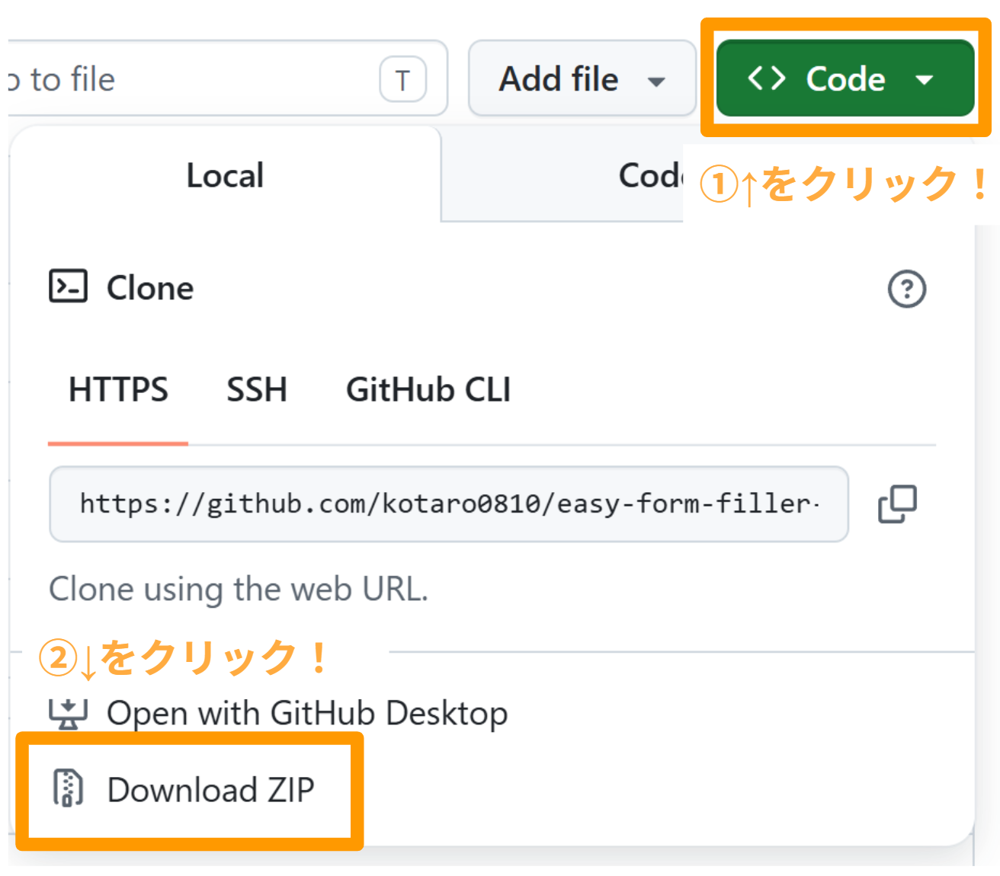

# 📋 申請フォーム入力補助ブックマークレット作成ツール

## 📝 概要

このツールは、ウェブサイトの申請フォームを簡単に自動入力するための「ブックマークレット」を作成するものです。ブックマークレットとは、ブラウザのブックマーク（お気に入り）として保存できる小さなプログラムのことです。これを使うと、面倒なフォーム入力の手間を省くことができます。

システムに詳しくない方でも、簡単な手順でご利用いただけます。Windowsパソコンで動作します。

## 🛠️ 必要なもの

- Windowsパソコン
- インターネットブラウザ（Chrome、Edge、Firefoxなど）

## 🚀 使い方

### 📦 ステップ1: ツールの準備

1. GitHubからこのリポジトリをZIPファイルとしてダウンロードし、解凍してください。 
    
2. 解凍したフォルダ内のファイルが揃っているか確認しましょう：
   - `make_bookmarklet.bat` （メインの実行ファイル）
   - `script_template.js` （プログラムのテンプレート）
   - `sample_page/` （サンプルページ）

### ⚙️ ステップ2: ブックマークレットの作成

1. `make_bookmarklet.bat` をダブルクリックして実行してください。
2. 画面に表示される質問に答えてください：
   - **組織名**: あなたの所属する組織の名前（例: 〇〇事業所）
   - **担当者名**: 担当者の名前（例: 山田太郎（〇〇事業所））
   - **件名**: フォームに自動入力する件名（例: 申請書）。空欄でスキップできます。
   - **ファイル名の接頭語**: アップロードするファイル名の先頭につける言葉（例: 申請書_）。空欄でもOKです。

3. しばらく待つと、処理が完了します。成功すると、以下のファイルが `output` フォルダ内に作成されます：
   - `output/[担当者名].js` （設定済みのプログラム）
   - `output/[担当者名].bookmarklet.txt` （ブラウザ登録用ファイル）
   
   ※ 件名を指定した場合、そのブックマークレットを使用するたびに自動入力されます。

### 🌐 ステップ3: ブラウザに登録

1. `output` フォルダ内の `[担当者名].bookmarklet.txt` をメモ帳などのテキストエディタで開いてください。
2. 中身をすべてコピーしてください（`javascript:` から始まる長い文字列です）。
3. ブラウザを開き、ブックマークバー（お気に入りバー）を表示してください。
   - Chromeの場合: 右上の三点マーク → ブックマーク → ブックマークバーを表示
   - Edgeの場合: 右上の三点マーク → お気に入り → お気に入りバーを表示
4. ブックマークバー上で右クリックし、「新しいブックマークを追加」を選択してください。
5. 名前を付けて（例: 申請自動入力）、URL欄にコピーした内容を貼り付けて保存してください。

### 🎯 ステップ4: 使用方法

1. 申請フォームのページを開いてください。
2. 必須のファイルをアップロードしてください。
3. 作成したブックマークレットをクリックしてください。
4. 自動的に組織名、担当者名、件名（指定時）、申請番号が入力されます！

## 🧪 サンプルページで試す

ツールにはサンプルページが付いています。`sample_page/index.html` をブラウザで開いて、ブックマークレットの動作を確認できます。

1. サンプルページを開く
2. ファイルをアップロード
3. ブックマークレットをクリックして自動入力されるのを確認

## ⚠️ 注意事項

- このツールはWindows専用です。
- ブックマークレットはJavaScriptで作られています。ブラウザのセキュリティ設定によっては動作しない場合があります。
- 作成したブックマークレットは、そのパソコン上のブラウザでのみ使用できます。
- ファイル名から申請番号を自動抽出します。ファイル名の形式が合わない場合は手動入力してください。
- 問題が発生したら、`script_template.js` が同じフォルダにあるか確認してください。

## 🔧 トラブルシューティング

- **「処理に失敗しました」と表示される**: `script_template.js` が同じフォルダにあるか確認してください。
- **ブックマークレットが動作しない**: ブラウザのJavaScriptが有効になっているか確認してください。
- **ファイル名が正しく抽出されない**: ファイル名の形式を確認してください。接頭語を設定すると抽出がうまくいく場合があります。

## 💡 技術的な詳細（上級者向け）

このツールは以下の処理を行っています：
1. JavaScriptテンプレートの設定値（組織名、担当者名、件名、ファイル名接頭語）を置き換え
2. コードを1行に圧縮（ミニファイ）
3. `javascript:` スキームでブックマークレット形式に変換
4. サンプルページの選択肢を更新

必要に応じて `script_template.js` を編集して機能をカスタマイズできます。

### 自動入力される項目
- **件名**（`id="subject"`）: configで指定されている場合のみ入力
- **組織名**（`id="court"`）: 常に入力
- **担当者名**（`id="judge"`）: 常に入力
- **申請番号**（`id="warrantNumber"`）: ファイル名から自動抽出して入力
